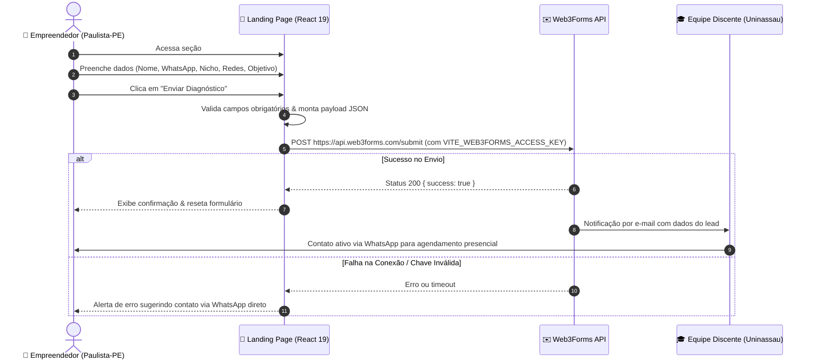
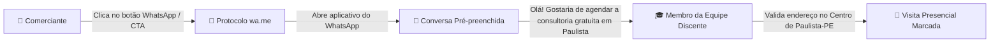

# 🔄 Fluxo de Dados & Tráfego de Informações

Este documento descreve como as informações trafegam dentro do sistema, desde a navegação do usuário pela landing page até o processamento das solicitações de consultoria e o agendamento presencial.

---

## 🗺️ Visão Geral dos Fluxos

A aplicação possui dois fluxos principais de conversão e tráfego de dados:
1. **Fluxo de Diagnóstico Digital (Assíncrono via Formulário):** Coleta estruturada das necessidades do comerciante para triagem da equipe.
2. **Fluxo de Contato Imediato (Direto via WhatsApp):** Conversão instantânea para comerciantes que preferem atendimento sem preencher formulários.

---

## 📊 Diagrama de Sequência: Formulário de Diagnóstico

---

## 💬 Diagrama de Fluxo: Contato Direto via WhatsApp

---

## 📋 Payload de Dados do Diagnóstico

Ao submeter o componente `GetStarted.jsx`, o seguinte esquema de dados é estruturado:

| Campo do Payload | Origem no Formulário | Descrição / Objetivo |
| :--- | :--- | :--- |
| `access_key` | `env.VITE_WEB3FORMS_ACCESS_KEY` | Autenticação da requisição na API externa. |
| `subject` | Dinâmico | Assunto do e-mail: `🚀 Novo Lead: {nome} ({nicho})`. |
| `nome` | `formData.name` | Nome completo do comerciante ou responsável. |
| `email` | `formData.email` | E-mail para contato e envio de material complementar. |
| `whatsapp` | `formData.whatsapp` | Telefone com DDD para agendamento presencial via WhatsApp. |
| `nicho` | `formData.niche` | Ramo do comércio (ex: vestuário, alimentação, serviços). |
| `possui_redes` | `formData.hasSocial` | Indicador se já possui canais digitais ou começará do zero. |
| `canais_ou_situacao` | `formData.socialLinks` ou `digitalSituation` | Links para perfis atuais ou descrição do momento do negócio. |
| `momento_atual` | `formData.moment` | Nível de maturidade digital percebido pelo cliente. |
| `objetivo` | `formData.goal` | Principal meta (atrair clientes, aumentar vendas, organizar feed). |

---

## 🛡️ Gestão de Estado & Armazenamento

- **Estado em Memória:** Os inputs do formulário são gerenciados pelo hook `useState` do React de forma estritamente local dentro do componente `GetStarted.jsx`.
- **Sem Persistência Local Sensível:** Nenhum dado sensível do comerciante fica gravado em `localStorage` ou `cookies` no dispositivo do visitante, reduzindo riscos de vazamento de dados em aparelhos compartilhados.
- **Conformidade LGPD:** Os dados transitam cifrados via HTTPS/TLS e são consumidos unicamente pela equipe de extensão universitária para fins pedagógicos e de agendamento presencial.

---

*Documento mantido dentro do vault `.ai-context` como referência de arquitetura de dados.*
