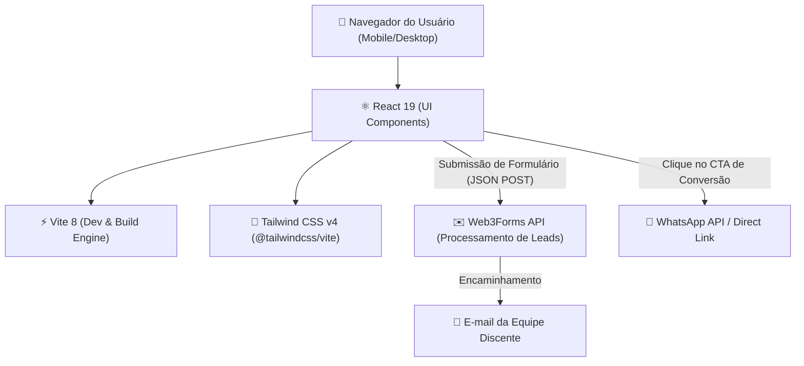

# 🛠️ Stack Tecnológica & Integrações

Este documento detalha o conjunto de tecnologias, bibliotecas e integrações utilizadas no projeto de extensão **Consultoria de Presença Digital**.

---

## 🏗️ Visão Geral da Arquitetura

O projeto é construído como uma **Single Page Application (SPA)** focada em alto desempenho, carregamento ultra-rápido em dispositivos móveis e arquitetura *backendless* para captação de dados de diagnósticos.



---

## 💻 Tecnologias do Core

| Camada | Tecnologia | Versão | Motivação & Papel |
| :--- | :--- | :--- | :--- |
| **Frontend UI** | [React](https://react.dev/) | `^19.2.8` | Construção declarativa da interface baseada em componentes funcionais e hooks nativos. |
| **Tooling & Bundler** | [Vite](https://vite.dev/) | `^8.2.2` | Ferramenta de build moderna com Hot Module Replacement (HMR) ultrarrápido e saída estática otimizada. |
| **Plugin Vite React** | `@vitejs/plugin-react` | `^6.1.0` | Suporte ao Fast Refresh e JSX compilation moderna. |
| **Estilização** | [Tailwind CSS](https://tailwindcss.com/) | `^4.3.3` | Framework CSS utilitário para design responsivo mobile-first sem overhead de CSS manual extenso. |
| **Plugin Tailwind Vite** | `@tailwindcss/vite` | `^4.3.3` | Integração nativa do Tailwind v4 com o pipeline do Vite via motor CSS moderno. |
| **Linter** | [Oxlint](https://oxc.rs/) | `^1.79.0` | Linter em Rust ultrarrápido, garantindo código limpo e conformidade com regras de hooks. |

---

## 🔌 Integrações Externas

### 1. Web3Forms API
- **Finalidade:** Recebimento e processamento dos formulários de diagnóstico digital preenchidos pelos comerciantes locais.
- **Endpoint:** `https://api.web3forms.com/submit`
- **Método:** `POST` com payload JSON.
- **Autenticação:** Chave de acesso configurada via variável de ambiente `VITE_WEB3FORMS_ACCESS_KEY`.
- **Benefício:** Elimina a necessidade de manter infraestrutura de servidor ou banco de dados exclusivo para a landing page, entregando os leads diretamente no e-mail da equipe discente.

### 2. WhatsApp Direct Click
- **Finalidade:** Canal prioritário de atendimento humanizado e agendamento de visitas presenciais.
- **Mecanismo:** Links diretos utilizando o protocolo `https://wa.me/<numero>?text=<mensagem_codificada>`.

---

## 📦 Estrutura de Scripts (`package.json`)

```bash
# Iniciar servidor de desenvolvimento local
npm run dev

# Gerar build otimizado para produção (/dist)
npm run build

# Executar checagem estática de linter com Oxlint
npm run lint

# Visualizar build localmente
npm run preview
```

---

## 🌐 Hospedagem & Deploy

- **Ambiente:** Servidor estático (Vercel, Netlify, Cloudflare Pages ou GitHub Pages).
- **Diretório de Distribuição:** `dist/`.
- **Variáveis de Ambiente Requeridas:**
  - `VITE_WEB3FORMS_ACCESS_KEY`: Chave para envio do formulário de diagnóstico.

---

*Documento mantido dentro do vault `.ai-context` como referência técnica primária.*
