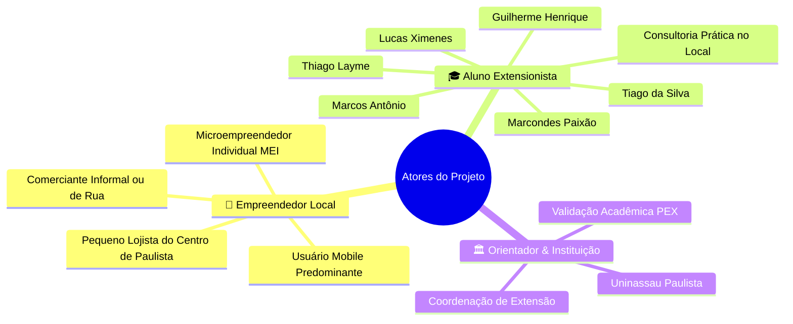

# 👥 Perfis de Usuário, Papéis e Permissões

Este documento mapeia os diferentes perfis envolvidos no ecossistema do projeto de extensão **Consultoria de Presença Digital** (PEX-MDL-54, Uninassau Paulista), suas responsabilidades, dores e interação com a landing page e a ação prática.

---

## 🎯 Mapa de Perfis

---

## 1. 👤 Empreendedor Local (Público-Alvo / Usuário Final)

### Descrição & Contexto
Comerciantes, feirantes, prestadores de serviços e pequenos empresários localizados no centro do município de Paulista-PE (ex: Av. Marechal Floriano Peixoto e adjacências). Geralmente operam com quadro de funcionários reduzido ou sozinhos.

### Principais Características
- **Dispositivo Principal:** Celular intermediário ou de entrada; quase não usam computador desktop para gerir o negócio.
- **Maturidade Digital:** Baixa a moderada. Conhecem o Instagram e o WhatsApp pessoalmente, mas têm dificuldades em configurar o WhatsApp Business (catálogos, mensagens automáticas) e manter consistência no feed/stories.
- **Orçamento:** Baixo ou inexistente para contratação de agências de publicidade ou softwares caros de automação.

### Dores Mapeadas
- Sentimento de isolamento na gestão do negócio ("faço tudo sozinho").
- Baixo engajamento e poucas vendas oriundas da internet.
- Falta de técnica para fotografar produtos com boa iluminação e nitidez.
- Sobrecarga de termos técnicos e estratégias complexas da internet que não se aplicam à realidade local de rua.

### Interação com o Sistema
- Acessa a landing page através de QR Code distribuído fisicamente em panfletos ou por links em grupos de comércio local.
- Consome a proposta de valor em linguagem direta e acessível.
- Solicita o agendamento da consultoria gratuita via formulário de diagnóstico ou mensagem no WhatsApp.

---

## 2. 🎓 Aluno Extensionista (Consultor Digital / Equipe Discente)

### Descrição
Estudantes do curso de Bacharelado em Ciência da Computação da Uninassau Paulista executando o projeto PEX-MDL-54:
- **Guilherme Henrique** (Matrícula: `01924729`)
- **Lucas Ximenes de Albuquerque** (Matrícula: `01893483`)
- **Marcos Antônio de Lima Lira Neto** (Matrícula: `01898289`)
- **Marcondes Paixão Silva de Albuquerque Júnior** (Matrícula: `01901595`)
- **Thiago Layme Firmino de Lima** (Matrícula: `01258187`)
- **Tiago da Silva dos Santos** (Matrícula: `01885658`)

### Responsabilidades & Ações
1. **Triagem de Leads:** Monitorar as submissões enviadas pelo formulário Web3Forms ou chamadas no WhatsApp.
2. **Contato Ativo:** Confirmar o horário, endereço exato e data da consultoria presencial no estabelecimento do comerciante.
3. **Execução em Campo:** Ir até o local de comércio em Paulista-PE e realizar o treinamento prático "mão na massa" com o próprio celular do comerciante:
   - Configuração de perfil comercial (bio, foto, links e catálogo no WhatsApp Business).
   - Dicas práticas de enquadramento fotográfico e iluminação natural para fotos de produtos.
   - Criação de rotina básica de postagem.
4. **Coleta de Evidências:** Fotografar a sessão e coletar depoimento/feedback do comerciante para o relatório acadêmico de extensão.

---

## 3. 🏛️ Orientador & Instituição de Ensino (Uninassau Paulista)

### Papel Institucional
- **Validação Metodológica:** Garantir que as atividades de extensão universitária cumpram a carga horária de curricularização e gerem impacto positivo tangível na comunidade de Paulista-PE.
- **Acompanhamento do Cronograma:** Avaliar entregas intermediárias (benchmark, desenvolvimento da landing page, intervenção de campo e relatório final).

---

## 🔐 Matriz de Acesso e Permissões

Como a solução é uma Landing Page pública orientada à conversão da comunidade local, o modelo de acessos segue o princípio do **menor atrito possível**:

| Funcionalidade / Tela | Empreendedor Local | Aluno Extensionista | Orientador |
| :--- | :---: | :---: | :---: |
| **Visualizar Landing Page** | Livre | Livre | Livre |
| **Preencher Diagnóstico** | Livre | Testes | Consulta |
| **Clicar no WhatsApp de Atendimento** | Livre | Recebe mensagem | - |
| **Acesso a Variáveis de Ambiente (`.env`)** | Não | Restrito à equipe | - |
| **Manutenção do Código-Fonte** | Não | Total (Git / Vite) | Avaliação |

---

*Documento mantido dentro do vault `.ai-context` como referência de papéis e regras de negócio.*
