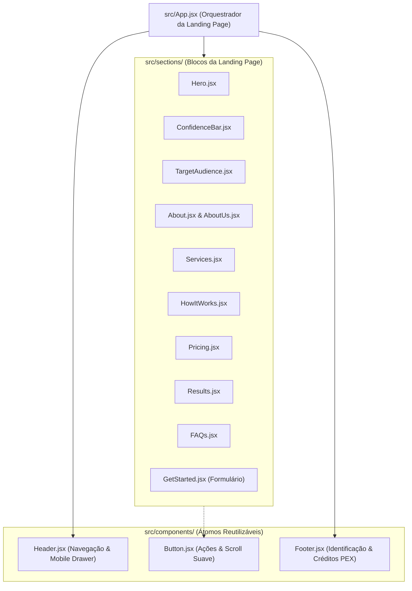

# 🧩 Padrões de Componentes UI & Estrutura de Seções

Este documento orienta a criação, refatoração e manutenção dos componentes visuais do projeto, estabelecendo a hierarquia entre componentes atômicos (`components/`) e seções de página (`sections/`).

---

## 🏛️ Divisão de Responsabilidades



---

## 🔘 Componentes Atômicos (`src/components/`)

### 1. `Button.jsx`
- **Finalidade:** Botão polimórfico que serve tanto para ações de clique convencionais (`onClick`) quanto para rolagem suave para âncoras da página (`to="id-da-secao"`).
- **Padrão de Implementação:**
  ```jsx
  export const Button = ({ children, className = "", to, onClick, ...props }) => {
    const handleClick = (e) => {
      if (to) {
        const element = document.getElementById(to);
        if (element) {
          element.scrollIntoView({ behavior: "smooth" });
        }
      }
      if (onClick) onClick(e);
    };

    return (
      <button
        onClick={handleClick}
        className={`group relative select-none font-medium text-[13px] text-[#9490ac] hover:text-white transition-all duration-300 ease-in-out cursor-pointer ${className}`}
        {...props}
      >
        <span>{children}</span>
        {/* Linha animada decorativa */}
        <span className="absolute -bottom-1 left-0 h-0.5 w-full scale-x-0 origin-left bg-purple-500 transition-transform duration-300 ease-in-out group-hover:scale-x-100" />
      </button>
    );
  };
  ```

### 2. `Header.jsx`
- **Finalidade:** Barra superior fixa/translúcida (`backdrop-blur`) contendo logotipo, links com scroll suave e botão de CTA prioritário ("Fazer Diagnóstico").
- **Responsividade:** Deve conter gaveta ou menu hambúrguer para dispositivos móveis com fechamento automático ao clicar em um link.

### 3. `Footer.jsx`
- **Finalidade:** Rodapé institucional destacando a realização acadêmica (Uninassau Paulista, PEX-MDL-54, Ciência da Computação) e os nomes dos discentes da equipe.

---

## 📑 Seções de Conteúdo (`src/sections/`)

### Diretrizes de Implementação de Seções:
1. **Identificador Único (`id`):** Cada seção deve conter uma propriedade `id` correspondente (ex.: `<section id="servicos">`) para permitir que a navegação do `Header` e os botões de ação rolem suavemente até ela.
2. **Separação de Dados Estáticos:** Sempre que a seção exibir cartões ou listas (ex.: serviços, perguntas do FAQ, etapas de como funciona), defina o array de dados como uma constante fora da função do componente:
   ```jsx
   const ETAPAS_MENTORIA = [
     { id: 1, titulo: "Diagnóstico", desc: "Avaliamos seu perfil atual." },
     { id: 2, titulo: "Prática no Local", desc: "Configuramos tudo no seu celular." },
   ];

   export default function HowItWorks() {
     return (
       <section id="como-funciona" className="py-20">
         {ETAPAS_MENTORIA.map((etapa) => (
           <div key={etapa.id}>...</div>
         ))}
       </section>
     );
   }
   ```
3. **Formulário de Diagnóstico (`GetStarted.jsx`):**
   - Deve implementar desabilitação de botão enquanto a requisição para o Web3Forms estiver em andamento.
   - Mensagens claras de sucesso e tratamento de erros de rede.
   - Validação mínima no lado do cliente (campos preenchidos e formato de telefone/WhatsApp com DDD).

---

## 🎨 Boas Práticas Visuais nos Componentes

- **Espaçamento e Ritmo:** Utilizar padding vertical padronizado entre seções (`py-16` a `py-24`) para manter harmonia visual.
- **Contraste de Texto:** Textos de apoio devem utilizar tons de cinza legíveis (`text-slate-300` ou `text-zinc-400`), evitando cinzas muito apagados que dificultam leitura em smartphones sob iluminação externa.
- **Microinterações:** Usar transições suaves (`transition-all duration-300`) em botões, links e cards hover.

---

*Documento mantido dentro do vault `.ai-context` como guia de componentes de interface.*
